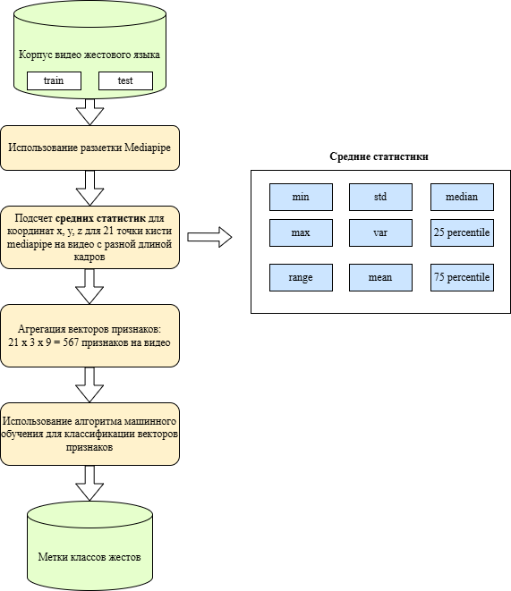

# Базовый метод классификации видео жестовых языков

Схема функционального метода представлена на рисунке ниже:

# Результаты классификации дактиля РЖЯ (33 класса) базовым методом
| Модель | Accuracy |
|------|------|
| Гауссовский наивный Байес | 0,10 |
| k-ближайших соседей | 0,12 |
| Рандомный лес | 0,24 |
| CatBoost | 0,27 |
| XGBoost | 0,32 |
| LightGBM | 0,38 |
| Многослойный перцептрон (MLP) | 0,39 |
| Метод опорных векторов | **0,47** |

# Результаты классификации всех классов Slovo (1000 классов) базовым методом
| Модель | Accuracy |
|------|------|
| LightGBM | 0,02 |
| CatBoost | 0,03 |
| Гауссовский наивный Байес | 0,06 |
| k-ближайших соседей | 0,06 |
| Логистическая регрессия | 0,06 |
| Рандомный лес | 0,12 |
| XGBoost | 0,17 |
| Метод опорных векторов | 0,21 |
| Многослойный перцептрон (MLP) | **0,44** |

